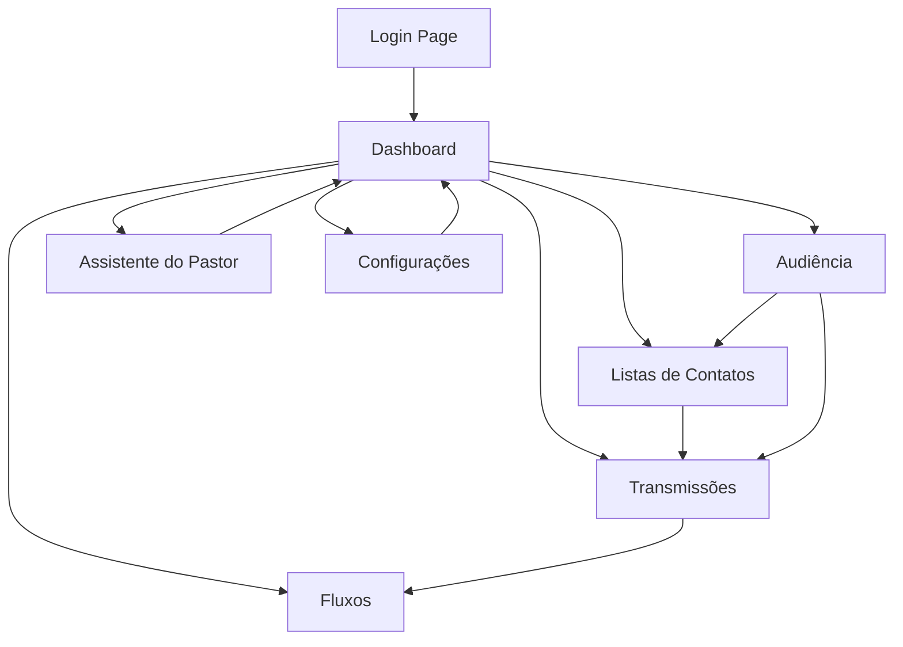

## 1. Product Overview
Sistema CRM administrativo para igrejas com gestão de audiência, transmissões de mensagens e assistente de IA para preparação de pregações.
- Resolve a necessidade de organização e comunicação eficiente com membros e visitantes.
- Permite que líderes religiosos gerenciem contatos, criem campanhas de comunicação e preparem mensagens com suporte de IA.

## 2. Core Features

### 2.1 User Roles
| Role | Registration Method | Core Permissions |
|------|---------------------|------------------|
| Admin | Convite direto | Acesso total ao sistema, gestão de usuários e configurações |
| Pastor | Cadastro aprovado por admin | Gerenciar audiência, criar transmissões, acessar assistente de IA |
| Líder | Cadastro aprovado por admin/pastor | Gerenciar contatos, criar listas, visualizar relatórios |
| Atendente | Cadastro aprovado por admin/pastor | Visualizar e editar contatos, enviar transmissões pré-aprovadas |

### 2.2 Feature Module
Nosso sistema CRM para igrejas consiste nos seguintes módulos principais:
1. **Dashboard**: Visão geral do sistema, estatísticas e navegação principal.
2. **Audiência**: Gerenciamento de contatos com cadastro, importação/exportação e segmentação.
3. **Listas de Contatos**: Criação e gestão de listas para segmentação de audiência.
4. **Transmissões**: Criação e agendamento de campanhas de mensagens via WhatsApp.
5. **Fluxos**: Automação de mensagens com sequências programadas e condições.
6. **Assistente do Pastor**: Geração de conteúdo bíblico com IA para preparação de pregações.
7. **Configurações**: Gestão de usuários, permissões e preferências do sistema.

### 2.3 Page Details
| Page Name | Module Name | Feature description |
|-----------|-------------|---------------------|
| Dashboard | Estatísticas | Visualizar total de contatos, transmissões ativas, taxas de engajamento e gráficos de crescimento da audiência. |
| Dashboard | Navegação Rápida | Acessar módulos principais através de cards com ícones e estatísticas resumidas. |
| Audiência | Cadastro de Contatos | Inserir nome, telefone, email, data de nascimento e tags personalizadas com validação de dados. |
| Audiência | Importação/Exportação | Upload de arquivos XLS/XLSX com mapeamento de colunas e download de templates para importação. |
| Audiência | Filtros e Busca | Buscar por nome, telefone, email, tags e data de cadastro com filtros combinados. |
| Audiência | Gerenciamento de Tags | Criar, editar e excluir tags personalizadas para segmentação de contatos. |
| Listas de Contatos | Criar Lista | Definir nome, descrição e critérios de segmentação para nova lista. |
| Listas de Contatos | Associar Contatos | Adicionar/remover contatos individuais ou por filtros em listas existentes. |
| Transmissões | Criar Campanha | Definir nome, mensagem, lista de destinatários e configurar agendamento. |
| Transmissões | Agendamento | Selecionar data, hora e fuso horário para envio programado com opção de recorrência. |
| Transmissões | Configuração de Intervalo | Definir tempo entre mensagens para evitar bloqueios no WhatsApp. |
| Transmissões | Integração WhatsApp | Conectar conta WhatsApp Business API e visualizar status de entrega. |
| Fluxos | Criar Fluxo | Definir nome do fluxo e criar sequência de etapas com mensagens. |
| Fluxos | Configurar Etapas | Adicionar mensagem, atraso (em horas/dias), condições baseadas em respostas e ações subsequentes. |
| Fluxos | Gerenciar Fluxos | Ativar/desativar fluxos, visualizar estatísticas de execução e editar etapas. |
| Assistente do Pastor | Inserir Tema | Digitar tema da pregação e selecionar referências bíblicas base. |
| Assistente do Pastor | Gerar Conteúdo | Criar referências bíblicas, esboço da mensagem, aplicação prática e apelo final com IA. |
| Assistente do Pastor | Histórico | Visualizar, editar e reutilizar esboços gerados anteriormente com busca por tema. |
| Configurações | Gestão de Usuários | Adicionar, editar e remover usuários com definição de roles e permissões. |
| Configurações | Preferências do Sistema | Configurar integrações, limites de envio e personalização de mensagens. |
| Login | Autenticação | Entrar com email e senha com recuperação de senha via email. |
| Register | Cadastro | Criar conta com aprovação pendente do administrador do sistema. |

## 3. Core Process
### Fluxo Principal do Usuário (Pastor/Líder):
1. Usuario acessa o sistema através da página de login
2. Dashboard mostra visão geral com estatísticas da igreja
3. Acessa módulo Audiência para cadastrar novos contatos ou importar lista existente
4. Cria listas de contatos segmentadas por tags ou critérios específicos
5. Desenvolve transmissões de mensagens para comunicar eventos ou informações importantes
6. Configura fluxos automatizados para nutrição espiritual sequencial
7. Utiliza Assistente do Pastor para preparar conteúdo de pregações

### Fluxo do Administrador:
1. Aprova novos cadastros de usuários e define suas permissões
2. Monitora uso do sistema e estatísticas gerais
3. Gerencia configurações de integração com WhatsApp Business
4. Supervisiona todas as transmissões e fluxos ativos

## 4. User Interface Design

### 4.1 Design Style
- **Cores Primárias**: Azul royal (#4169E1) e branco (#FFFFFF)
- **Cores Secundárias**: Dourado (#FFD700) e cinza claro (#F5F5F5)
- **Estilo de Botões**: Arredondados com sombra suave, hover effects em dourado
- **Fonte**: Inter para textos, serifadas para títulos principais (Playfair Display)
- **Tamanhos de Fonte**: 14px corpo, 16px menus, 24px títulos, 32px headers
- **Layout**: Sidebar fixa à esquerda, conteúdo principal com cards base
- **Ícones**: Estilo line icons minimalistas, preferencialmente Feather Icons

### 4.2 Page Design Overview
| Page Name | Module Name | UI Elements |
|-----------|-------------|-------------|
| Dashboard | Estatísticas | Cards com números grandes, gráficos de pizza/barras em tons de azul e dourado, layout grid 3x2. |
| Audiência | Tabela de Contatos | Tabela responsiva com paginação, filtros em dropdown, botões de ação com ícones, modal para cadastro. |
| Transmissões | Formulário de Campanha | Editor de texto rico para mensagens, seletor de data/hora com calendário, preview de mensagem em tempo real. |
| Fluxos | Visualização de Etapas | Interface tipo kanban com drag-and-drop, conectores visuais entre etapas, indicadores de tempo. |
| Assistente do Pastor | Gerador de Conteúdo | Textarea grande para tema, botão prominente de gerar, cards para cada seção do esboço, editor inline. |

### 4.3 Responsiveness
- **Desktop-first**: Otimizado para telas grandes (1366px+), sidebar sempre visível
- **Mobile-adaptive**: Menu hamburger para mobile, tabelas convertem para cards, formulários em coluna única
- **Touch optimization**: Botões com área de toque mínima 44px, suporte a swipe em listas

### 4.4 3D Scene Guidance
Não aplicável - este é um sistema administrativo 2D focado em gestão de dados e comunicação.