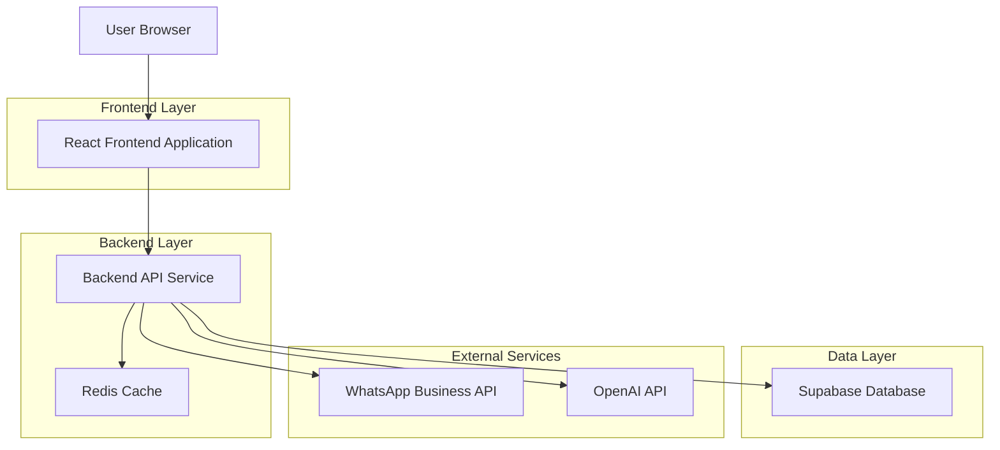
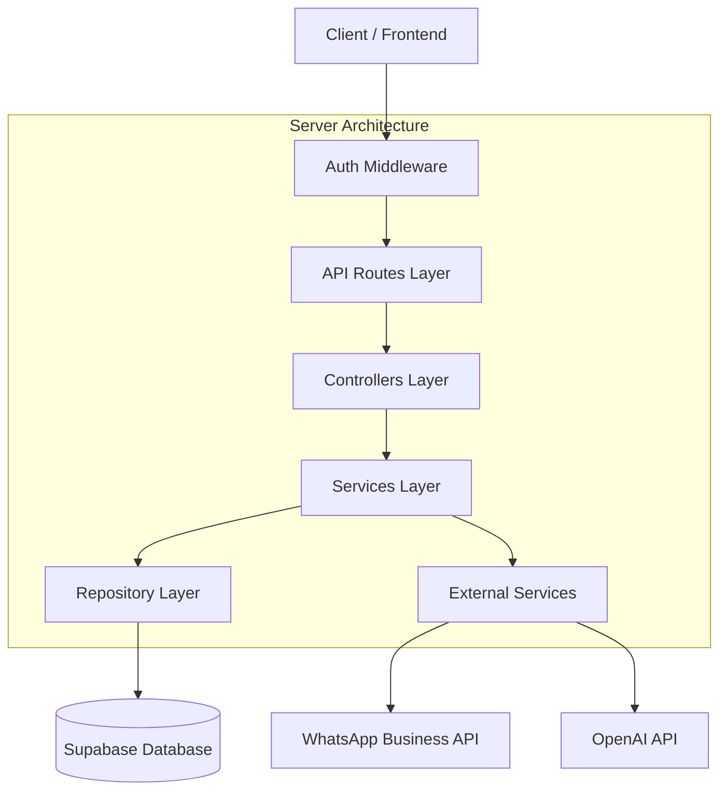
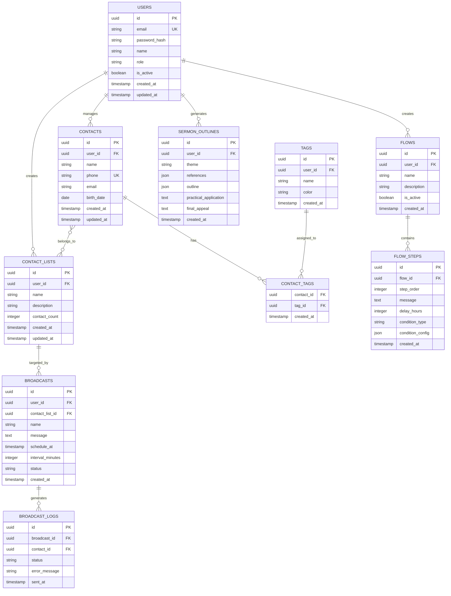

## 1. Architecture design



## 2. Technology Description

- **Frontend**: React@18 + tailwindcss@3 + vite
- **Initialization Tool**: vite-init
- **Backend**: Express@4 + Node.js@18
- **Database**: Supabase (PostgreSQL)
- **Cache**: Redis@7
- **AI Integration**: OpenAI GPT-4 API
- **WhatsApp Integration**: WhatsApp Business API

## 3. Route definitions

| Route | Purpose |
|-------|---------|
| / | Dashboard principal com estatísticas e navegação |
| /login | Página de autenticação de usuários |
| /register | Cadastro de novos usuários com aprovação pendente |
| /audience | Gerenciamento de contatos e audiência |
| /lists | Criação e gestão de listas de contatos |
| /broadcasts | Criação e agendamento de transmissões |
| /flows | Configuração de fluxos automatizados de mensagens |
| /assistant | Assistente de IA para preparação de pregações |
| /settings | Configurações do sistema e gestão de usuários |
| /profile | Perfil do usuário logado |

## 4. API definitions

### 4.1 Authentication APIs

```
POST /api/auth/login
```

Request:
| Param Name | Param Type | isRequired | Description |
|------------|------------|------------|-------------|
| email | string | true | Email do usuário |
| password | string | true | Senha do usuário |

Response:
| Param Name | Param Type | Description |
|------------|------------|-------------|
| token | string | JWT token para autenticação |
| user | object | Dados do usuário (id, name, role) |

### 4.2 Contact Management APIs

```
GET /api/contacts
```

Query Parameters:
| Param Name | Param Type | Description |
|------------|------------|-------------|
| page | number | Número da página |
| limit | number | Limite de registros por página |
| search | string | Termo de busca |
| tags | array | Filtro por tags |

Response:
| Param Name | Param Type | Description |
|------------|------------|-------------|
| contacts | array | Array de objetos de contato |
| total | number | Total de contatos |
| pages | number | Número total de páginas |

```
POST /api/contacts/import
```

Request (multipart/form-data):
| Param Name | Param Type | Description |
|------------|------------|-------------|
| file | file | Arquivo XLS/XLSX com contatos |
| mapping | object | Mapeamento de colunas |

### 4.3 Broadcast APIs

```
POST /api/broadcasts
```

Request:
| Param Name | Param Type | Description |
|------------|------------|-------------|
| name | string | Nome da campanha |
| message | string | Mensagem a ser enviada |
| contact_list_id | string | ID da lista de contatos |
| schedule_at | datetime | Data/hora de agendamento |
| interval_minutes | number | Intervalo entre mensagens |

### 4.4 AI Assistant APIs

```
POST /api/ai/sermon-outline
```

Request:
| Param Name | Param Type | Description |
|------------|------------|-------------|
| theme | string | Tema da pregação |
| biblical_references | array | Referências bíblicas base (opcional) |
| style | string | Estilo da pregação (evangelística, doutrinária, etc) |

Response:
| Param Name | Param Type | Description |
|------------|------------|-------------|
| references | array | Referências bíblicas sugeridas |
| outline | object | Estrutura da mensagem com introdução, desenvolvimento e conclusão |
| practical_application | string | Aplicação prática para os ouvintes |
| final_appeal | string | Apelo final da mensagem |

## 5. Server architecture diagram



## 6. Data model

### 6.1 Data model definition



### 6.2 Data Definition Language

```sql
-- Users table
CREATE TABLE users (
    id UUID PRIMARY KEY DEFAULT gen_random_uuid(),
    email VARCHAR(255) UNIQUE NOT NULL,
    password_hash VARCHAR(255) NOT NULL,
    name VARCHAR(100) NOT NULL,
    role VARCHAR(20) NOT NULL CHECK (role IN ('admin', 'pastor', 'leader', 'attendant')),
    is_active BOOLEAN DEFAULT true,
    created_at TIMESTAMP WITH TIME ZONE DEFAULT NOW(),
    updated_at TIMESTAMP WITH TIME ZONE DEFAULT NOW()
);

-- Contacts table
CREATE TABLE contacts (
    id UUID PRIMARY KEY DEFAULT gen_random_uuid(),
    user_id UUID REFERENCES users(id) ON DELETE CASCADE,
    name VARCHAR(100) NOT NULL,
    phone VARCHAR(20) NOT NULL,
    email VARCHAR(255),
    birth_date DATE,
    created_at TIMESTAMP WITH TIME ZONE DEFAULT NOW(),
    updated_at TIMESTAMP WITH TIME ZONE DEFAULT NOW(),
    UNIQUE(user_id, phone)
);

-- Tags table
CREATE TABLE tags (
    id UUID PRIMARY KEY DEFAULT gen_random_uuid(),
    user_id UUID REFERENCES users(id) ON DELETE CASCADE,
    name VARCHAR(50) NOT NULL,
    color VARCHAR(7) DEFAULT '#4169E1',
    created_at TIMESTAMP WITH TIME ZONE DEFAULT NOW()
);

-- Contact tags relationship
CREATE TABLE contact_tags (
    contact_id UUID REFERENCES contacts(id) ON DELETE CASCADE,
    tag_id UUID REFERENCES tags(id) ON DELETE CASCADE,
    created_at TIMESTAMP WITH TIME ZONE DEFAULT NOW(),
    PRIMARY KEY (contact_id, tag_id)
);

-- Contact lists table
CREATE TABLE contact_lists (
    id UUID PRIMARY KEY DEFAULT gen_random_uuid(),
    user_id UUID REFERENCES users(id) ON DELETE CASCADE,
    name VARCHAR(100) NOT NULL,
    description TEXT,
    contact_count INTEGER DEFAULT 0,
    created_at TIMESTAMP WITH TIME ZONE DEFAULT NOW(),
    updated_at TIMESTAMP WITH TIME ZONE DEFAULT NOW()
);

-- Contact list members
CREATE TABLE contact_list_members (
    list_id UUID REFERENCES contact_lists(id) ON DELETE CASCADE,
    contact_id UUID REFERENCES contacts(id) ON DELETE CASCADE,
    added_at TIMESTAMP WITH TIME ZONE DEFAULT NOW(),
    PRIMARY KEY (list_id, contact_id)
);

-- Broadcasts table
CREATE TABLE broadcasts (
    id UUID PRIMARY KEY DEFAULT gen_random_uuid(),
    user_id UUID REFERENCES users(id) ON DELETE CASCADE,
    contact_list_id UUID REFERENCES contact_lists(id) ON DELETE CASCADE,
    name VARCHAR(100) NOT NULL,
    message TEXT NOT NULL,
    schedule_at TIMESTAMP WITH TIME ZONE,
    interval_minutes INTEGER DEFAULT 1,
    status VARCHAR(20) DEFAULT 'pending' CHECK (status IN ('pending', 'scheduled', 'sending', 'completed', 'failed')),
    created_at TIMESTAMP WITH TIME ZONE DEFAULT NOW()
);

-- Broadcast logs
CREATE TABLE broadcast_logs (
    id UUID PRIMARY KEY DEFAULT gen_random_uuid(),
    broadcast_id UUID REFERENCES broadcasts(id) ON DELETE CASCADE,
    contact_id UUID REFERENCES contacts(id) ON DELETE CASCADE,
    status VARCHAR(20) NOT NULL,
    error_message TEXT,
    sent_at TIMESTAMP WITH TIME ZONE DEFAULT NOW()
);

-- Flows table
CREATE TABLE flows (
    id UUID PRIMARY KEY DEFAULT gen_random_uuid(),
    user_id UUID REFERENCES users(id) ON DELETE CASCADE,
    name VARCHAR(100) NOT NULL,
    description TEXT,
    is_active BOOLEAN DEFAULT true,
    created_at TIMESTAMP WITH TIME ZONE DEFAULT NOW()
);

-- Flow steps
CREATE TABLE flow_steps (
    id UUID PRIMARY KEY DEFAULT gen_random_uuid(),
    flow_id UUID REFERENCES flows(id) ON DELETE CASCADE,
    step_order INTEGER NOT NULL,
    message TEXT NOT NULL,
    delay_hours INTEGER DEFAULT 24,
    condition_type VARCHAR(50),
    condition_config JSONB,
    created_at TIMESTAMP WITH TIME ZONE DEFAULT NOW()
);

-- Sermon outlines
CREATE TABLE sermon_outlines (
    id UUID PRIMARY KEY DEFAULT gen_random_uuid(),
    user_id UUID REFERENCES users(id) ON DELETE CASCADE,
    theme VARCHAR(200) NOT NULL,
    references JSONB,
    outline JSONB,
    practical_application TEXT,
    final_appeal TEXT,
    created_at TIMESTAMP WITH TIME ZONE DEFAULT NOW()
);

-- Create indexes for performance
CREATE INDEX idx_contacts_user_id ON contacts(user_id);
CREATE INDEX idx_contacts_phone ON contacts(phone);
CREATE INDEX idx_contacts_name ON contacts(name);
CREATE INDEX idx_tags_user_id ON tags(user_id);
CREATE INDEX idx_contact_lists_user_id ON contact_lists(user_id);
CREATE INDEX idx_broadcasts_user_id ON broadcasts(user_id);
CREATE INDEX idx_broadcasts_status ON broadcasts(status);
CREATE INDEX idx_broadcast_logs_broadcast_id ON broadcast_logs(broadcast_id);
CREATE INDEX idx_flows_user_id ON flows(user_id);
CREATE INDEX idx_sermon_outlines_user_id ON sermon_outlines(user_id);

-- Grant permissions
GRANT SELECT ON ALL TABLES TO anon;
GRANT ALL PRIVILEGES ON ALL TABLES TO authenticated;
```