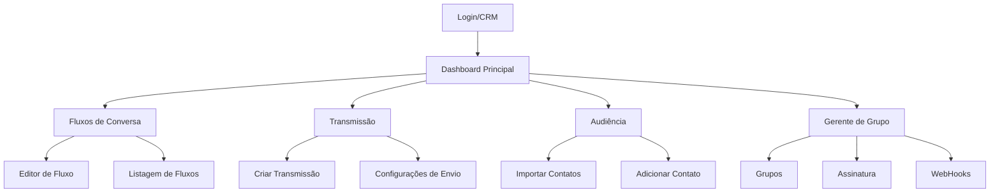

## 1. Product Overview

Celeiro Digital é um sistema SaaS B2B de CRM para automação de WhatsApp, permitindo que empresas gerenciem fluxos de conversa, transmissões em massa e audiências através de uma interface moderna e intuitiva.

O produto resolve o problema de gerenciamento manual de conversas no WhatsApp, automatizando processos de atendimento e marketing para pequenas e médias empresas que utilizam o WhatsApp como canal principal de comunicação com clientes.

## 2. Core Features

### 2.1 User Roles

| Role | Registration Method | Core Permissions |
|------|---------------------|------------------|
| Usuário Admin | Login via tela independente | Acesso completo a todos os módulos: fluxos, transmissão, audiência, gerente de grupo |

### 2.2 Feature Module

O sistema Celeiro Digital consiste nos seguintes módulos principais:

1. **Login/CRM**: Tela independente de autenticação com campos de email e senha
2. **Fluxos de Conversa**: Listagem de fluxos com editor visual drag & drop para criar automações de WhatsApp
3. **Transmissão**: Gerenciamento de campanhas de mensagens em massa com agendamento
4. **Audiência**: Gerenciamento de contatos com importação/exportação de dados
5. **Gerente de Grupo**: Administração de grupos do WhatsApp, assinaturas e webhooks

### 2.3 Page Details

| Page Name | Module Name | Feature description |
|-----------|-------------|---------------------|
| Login/CRM | Formulário de Login | Permite entrada com email e senha, link para recuperação de senha e registro novo usuário |
| Fluxos de Conversa | Listagem de Fluxos | Exibe pasta "Raiz" com lista de fluxos, mostra nome e plataforma WhatsApp para cada fluxo |
| Fluxos de Conversa | Ações de Fluxo | Fornece botões editar, duplicar, copiar código, copiar RawFlow e excluir para cada fluxo |
| Fluxos de Conversa | Botões de Ação | Inclui Raw Import, Importar, Adicionar e Nova pasta no topo da tela |
| Fluxos de Conversa | Modal Importar Fluxo | Campo para código do fluxo com botões Cancelar e Importar |
| Fluxos de Conversa | Modal Import RawFlow | Campo JSON com botões Cancelar e Importar |
| Fluxos de Conversa | Modal Adicionar Fluxo | Campo nome, campo atalhos, botão adicionar atalho com aviso visual de criação na pasta Raiz |
| Editor de Fluxo | Painel de Blocos | Exibe blocos disponíveis: Início, Conteúdo, Menu, Randomizador, Etiqueta, Controlador de Chat, Departamentos, Salvar, Remarketing, Condição, Conexão de fluxo, Atraso inteligente, Notificação, Manipulador, Distribuidor, Variável global |
| Editor de Fluxo | Canvas Central | Área visual com simulação drag & drop, bloco "Início do fluxo" com texto descritivo, bloco Conteúdo com token mockado, bloco Menu com pergunta "TUDO CERTO" e métricas de enviado/clicada |
| Transmissão | Tela Principal | Exibe empty state "Nenhuma transmissão encontrada" com botões Transmissão, Listas de Contatos e Configurações |
| Transmissão | Criar Transmissão | Formulário com nome, seleção de fluxo, WhatsApp, data/hora, tipo de transmissão e lista de contatos |
| Transmissão | Configurações de Envio | Define intervalo randômico 20s, pausa após 20 mensagens, intervalo maior 1 minuto |
| Audiência | Tabela de Contatos | Exibe colunas nome, WhatsApp, email, data de inscrição |
| Audiência | Botões de Ação | Inclui Importar XLS/XLSX, Importar outro formato, Adicionar, Exportar e Remover todos |
| Audiência | Modal Importação | Interface drag & drop, seleção de arquivo, texto formatos XLS/XLSX, link para download de modelo |
| Audiência | Modal Adicionar Contato | Formulário com nome, telefone (+55 Brasil), email, data de nascimento e informações adicionais |
| Gerente de Grupo | Grupos | Tabela com nome, tamanho, status, WhatsApp e ações, botão + Grupos, empty state |
| Gerente de Grupo | Fluxos | Empty state para lista de fluxos |
| Gerente de Grupo | Gerenciar | Empty state para gerenciamento |
| Gerente de Grupo | Assinatura | Cards Total de Assinaturas e Total de Grupos, filtros por status/grupo/vencimento, botão + Novo Assinante, empty state |
| Gerente de Grupo | WebHooks | Lista vazia, botão Criar Webhook, modal com nome e botões Cancelar/Criar |

## 3. Core Process

O fluxo principal do usuário no Celeiro Digital:

1. Usuário acessa tela de login independente
2. Após login, visualiza dashboard com sidebar contendo todos os módulos
3. Navega entre módulos através do menu lateral fixo
4. Em Fluxos de Conversa: cria, edita e gerencia automações de WhatsApp
5. Em Transmissão: cria campanhas de mensagens programadas
6. Em Audiência: gerencia base de contatos com importação/exportação
7. Em Gerente de Grupo: administra grupos, assinantes e webhooks

## 4. User Interface Design

### 4.1 Design Style

- **Cores Primárias**: Tons de azul escuro (#1e293b) e cinza escuro para dark mode
- **Cores Secundárias**: Verde para ações positivas (#10b981), vermelho para exclusões (#ef4444)
- **Estilo de Botões**: Arredondados com bordas suaves, efeitos hover sutis
- **Fontes**: Inter ou Roboto, tamanhos 14px para texto, 16px para botões, 20px+ para títulos
- **Layout**: Card-based com sombras suaves, espaçamento generoso (8px grid system)
- **Ícones**: Lucide React ou Heroicons, estilo outline minimalista

### 4.2 Page Design Overview

| Page Name | Module Name | UI Elements |
|-----------|-------------|-------------|
| Login/CRM | Tela de Login | Fundo gradiente escuro, card central arredondado, campos com ícones, botão primário destacado |
| Fluxos de Conversa | Listagem | Sidebar fixa escura, header com título, cards de fluxo com ações em dropdown, botões topo com ícones |
| Editor de Fluxo | Canvas | Divisão visual 70/30, sidebar esquerda com blocos coloridos, canvas com grid de fundo, conexões visuais entre blocos |
| Transmissão | Formulário | Formulário multi-etapas, campos agrupados logicamente, datepicker moderno, seleção múltipla com tags |
| Audiência | Tabela | Tabela com zebra striping, ações em menu suspenso, barra de busca no topo, paginação minimalista |
| Gerente de Grupo | Dashboard | Cards de métricas no topo, tabelas com status coloridos, filtros collapsibles, empty state com ilustração |

### 4.3 Responsiveness

- **Desktop-first**: Otimizado para telas grandes (1440px+)
- **Mobile-adaptive**: Sidebar transforma em menu hambúrguer em telas < 768px
- **Touch optimization**: Botões com área de toque mínima 44x44px, scroll suave em listas
- **Breakpoints**: 640px, 768px, 1024px, 1280px, 1536px

### 4.4 Estados de UI

- **Loading**: Spinners em botões, skeleton screens para tabelas, progress bars para uploads
- **Empty state**: Ilustrações customizadas por módulo, texto explicativo, call-to-action primário
- **Success**: Toasts verdes no canto superior direito, ícones de check animados
- **Error**: Bordas vermelhas em campos inválidos, mensagens inline, alertas com descrição detalhada