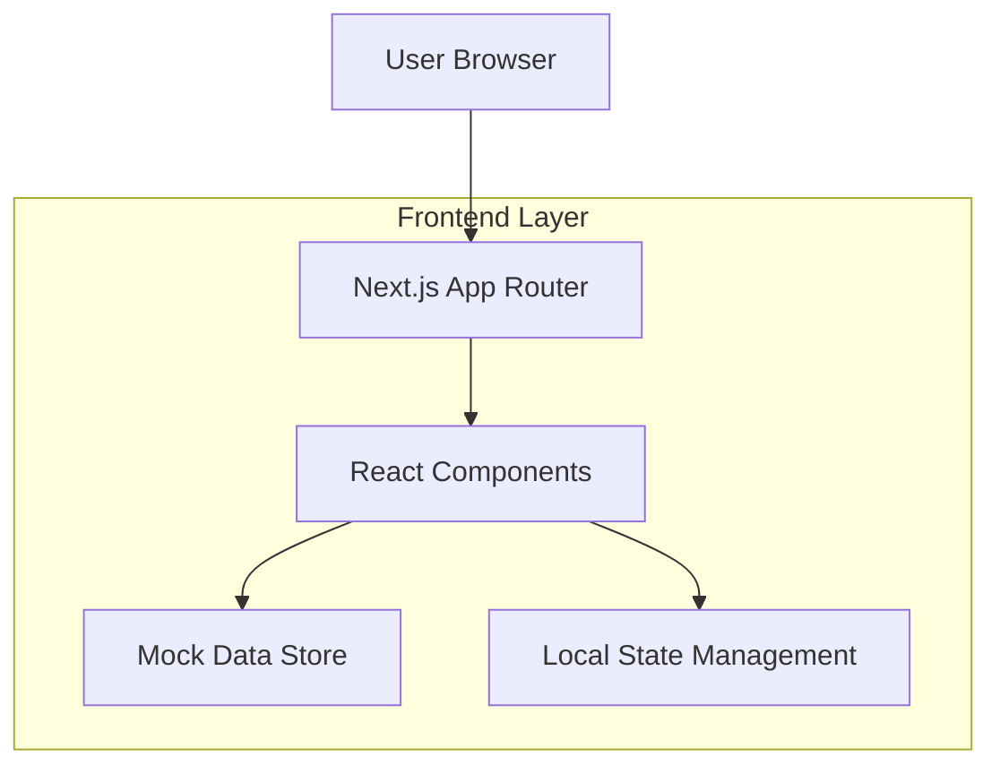

## 1. Architecture design



## 2. Technology Description

* **Frontend**: Next.js 14 (App Router) + React 18 + Tailwind CSS 3

* **Initialization Tool**: create-next-app

* **Backend**: None (Frontend-only)

* **Database**: None (Mock data arrays)

* **State Management**: React useState, useContext (local state only)

* **UI Components**: Headless UI, Radix UI (opcional para modais e dropdowns)

* **Icons**: Lucide React

* **Forms**: React Hook Form (opcional para validação)

* **Type Safety**: TypeScript

## 3. Route definitions

| Route                      | Purpose                                                   |
| -------------------------- | --------------------------------------------------------- |
| /login                     | Tela independente de autenticação com formulário de login |
| /dashboard                 | Dashboard principal com navegação lateral                 |
| /fluxos                    | Listagem de fluxos de conversa com ações de gerenciamento |
| /fluxos/novo               | Editor visual para criar novo fluxo de conversa           |
| /fluxos/\[id]/editar       | Editor visual para editar fluxo existente                 |
| /transmissao               | Gerenciamento de campanhas de transmissão                 |
| /transmissao/nova          | Formulário para criar nova transmissão                    |
| /transmissao/configuracoes | Configurações de envio e intervalos                       |
| /audiencia                 | Tabela de contatos com importação/exportação              |
| /audiencia/importar        | Interface de importação de contatos                       |
| /grupos                    | Gerenciamento de grupos do WhatsApp                       |
| /grupos/assinaturas        | Administração de assinantes e métricas                    |
| /grupos/webhooks           | Configuração de webhooks para integrações                 |

## 4. Component Architecture

### 4.1 Core Components Structure

```
src/
├── app/
│   ├── layout.tsx          # Root layout com sidebar e header
│   ├── login/page.tsx      # Tela de login independente
│   ├── dashboard/page.tsx  # Dashboard principal
│   ├── fluxos/
│   │   ├── page.tsx        # Listagem de fluxos
│   │   ├── novo/page.tsx   # Editor de fluxo
│   │   └── [id]/editar/page.tsx
│   ├── transmissao/
│   │   ├── page.tsx
│   │   └── nova/page.tsx
│   ├── audiencia/page.tsx
│   └── grupos/
│       ├── page.tsx
│       ├── assinaturas/page.tsx
│       └── webhooks/page.tsx
├── components/
│   ├── ui/                 # Componentes base (shadcn/ui style)
│   │   ├── button.tsx
│   │   ├── card.tsx
│   │   ├── modal.tsx
│   │   ├── table.tsx
│   │   └── toast.tsx
│   ├── layout/
│   │   ├── sidebar.tsx     # Sidebar fixa com navegação
│   │   ├── header.tsx      # Header superior com título
│   │   └── content.tsx     # Container de conteúdo
│   ├── fluxos/
│   │   ├── flow-list.tsx   # Lista de fluxos
│   │   ├── flow-editor.tsx # Editor visual
│   │   ├── flow-block.tsx  # Blocos do editor
│   │   └── flow-canvas.tsx # Canvas de edição
│   ├── transmissao/
│   │   ├── transmission-form.tsx
│   │   └── transmission-list.tsx
│   ├── audiencia/
│   │   ├── contact-table.tsx
│   │   └── import-modal.tsx
│   └── grupos/
│       ├── group-list.tsx
│       └── subscription-cards.tsx
├── lib/
│   ├── mock-data/          # Dados mockados
│   │   ├── flows.ts
│   │   ├── contacts.ts
│   │   └── groups.ts
│   ├── types/              # TypeScript types
│   └── utils/              # Funções utilitárias
└── hooks/
    ├── use-local-storage.ts
    └── use-toast.ts
```

### 4.2 Mock Data Structure

```typescript
// src/lib/mock-data/flows.ts
export interface Flow {
  id: string;
  name: string;
  platform: 'WhatsApp';
  folder: string;
  createdAt: Date;
  updatedAt: Date;
  blocks: FlowBlock[];
}

export interface FlowBlock {
  id: string;
  type: 'start' | 'content' | 'menu' | 'delay' | 'condition';
  position: { x: number; y: number };
  data: Record<string, any>;
  connections: string[];
}

// src/lib/mock-data/contacts.ts
export interface Contact {
  id: string;
  name: string;
  whatsapp: string;
  email: string;
  subscriptionDate: Date;
  additionalInfo?: string;
}

// src/lib/mock-data/groups.ts
export interface Group {
  id: string;
  name: string;
  size: number;
  status: 'active' | 'inactive';
  whatsapp: string;
}
```

### 4.3 State Management Pattern

```typescript
// Exemplo de gerenciamento de estado local
const [flows, setFlows] = useState<Flow[]>(mockFlows);
const [selectedFlow, setSelectedFlow] = useState<Flow | null>(null);
const [isModalOpen, setIsModalOpen] = useState(false);

// Funções de manipulação de dados (sem backend)
const createFlow = (flowData: Partial<Flow>) => {
  const newFlow = {
    ...flowData,
    id: generateId(),
    createdAt: new Date(),
    updatedAt: new Date(),
  } as Flow;
  setFlows([...flows, newFlow]);
};

const updateFlow = (id: string, updates: Partial<Flow>) => {
  setFlows(flows.map(flow => 
    flow.id === id ? { ...flow, ...updates, updatedAt: new Date() } : flow
  ));
};

const deleteFlow = (id: string) => {
  setFlows(flows.filter(flow => flow.id !== id));
};
```

## 5. UI/UX Implementation Guidelines

### 5.1 Dark Mode Implementation

```css
/* Tailwind CSS configuration */
:root {
  --background: 222.2 84% 4.9%;
  --foreground: 210 40% 98%;
  --card: 222.2 84% 4.9%;
  --card-foreground: 210 40% 98%;
  --primary: 217.2 91.2% 59.8%;
  --primary-foreground: 222.2 47.4% 11.2%;
  --secondary: 217.2 32.6% 17.5%;
  --secondary-foreground: 210 40% 98%;
}
```

### 5.2 Responsive Breakpoints

```typescript
// src/lib/utils/responsive.ts
export const breakpoints = {
  sm: '640px',
  md: '768px',
  lg: '1024px',
  xl: '1280px',
  '2xl': '1536px',
};

// Uso nos componentes
<div className="hidden md:block"> {/* Sidebar em desktop */}
<div className="md:hidden">      {/* Menu hambúrguer em mobile */}
```

### 5.3 Component Reusability Pattern

```typescript
// Exemplo de componente reutilizável
interface ButtonProps {
  variant?: 'primary' | 'secondary' | 'danger';
  size?: 'sm' | 'md' | 'lg';
  loading?: boolean;
  children: React.ReactNode;
  onClick?: () => void;
}

export const Button: React.FC<ButtonProps> = ({
  variant = 'primary',
  size = 'md',
  loading = false,
  children,
  onClick,
}) => {
  const baseClasses = 'rounded-lg font-medium transition-colors';
  const variantClasses = {
    primary: 'bg-blue-600 hover:bg-blue-700 text-white',
    secondary: 'bg-gray-700 hover:bg-gray-600 text-white',
    danger: 'bg-red-600 hover:bg-red-700 text-white',
  };
  
  return (
    <button
      className={`${baseClasses} ${variantClasses[variant]} ${sizeClasses[size]}`}
      onClick={onClick}
      disabled={loading}
    >
      {loading ? <Spinner /> : children}
    </button>
  );
};
```

## 6. Performance Considerations

### 6.1 Code Splitting

* Utilizar dynamic imports para módulos pesados

* Lazy loading para modais e componentes secundários

* Preload de fontes e ícones críticos

### 6.2 Mock Data Optimization

* Implementar paginação virtual para tabelas grandes

* Usar React.memo para componentes de lista

* Implementar debounce para buscas em tempo real

### 6.3 Bundle Size Management

* Tree shaking ativado no Next.js

* Importação seletiva de ícones Lucide

* Tailwind CSS com purging de classes não utilizadas

